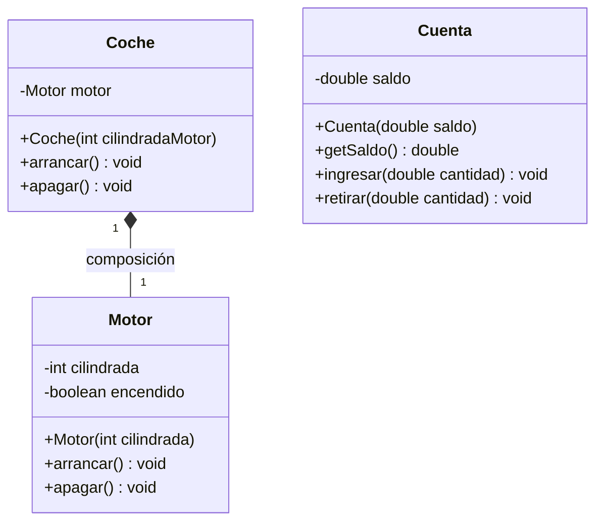

# Ejercicio 6.11 — Diagrama de clases UML

Sistema formado por `Coche` y `Motor` (Ejercicio 6.9) y `Cuenta` (Ejercicio 6.7).

**Notas sobre las relaciones:**

- `Coche` y `Motor` están unidas por **composición** (diamante relleno):
  cada `Coche` crea su propio `Motor` en el constructor, y el motor no tiene
  sentido ni existencia fuera de ese coche (su ciclo de vida depende
  completamente del coche que lo contiene). La multiplicidad es 1 a 1.
- `Cuenta` no tiene ninguna relación estructural con `Coche` ni con `Motor`:
  el método `transferir()` del Ejercicio 6.7 recibe objetos `Cuenta` como
  parámetros de un método estático, pero ninguna clase almacena una
  referencia permanente a otra `Cuenta`, así que no se dibuja ninguna
  asociación entre instancias de `Cuenta`.
