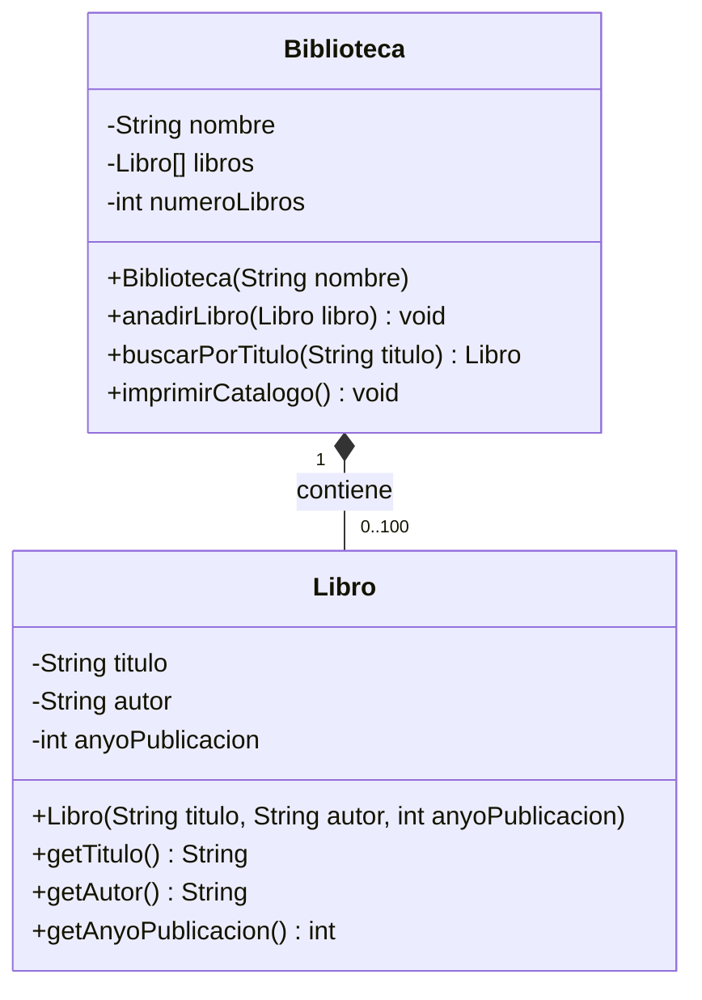

# Ejercicio 6.12 — Diagrama de clases UML (diseño previo a la implementación)

`Biblioteca` y `Libro` están unidas por **composición**: los libros se
almacenan en un array interno de `Biblioteca` con capacidad máxima de 100
elementos, y no se modela ninguna forma de que un `Libro` exista de forma
independiente a la biblioteca que lo gestiona en este diseño.
