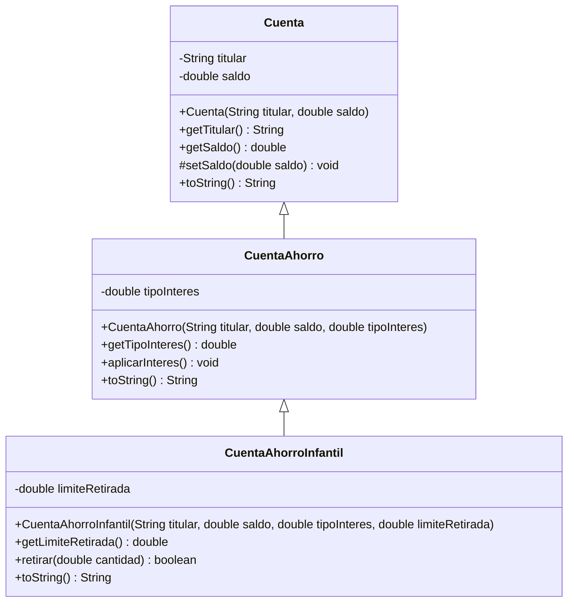

# Ejercicio 8.10 — Diagrama de clases UML

Jerarquía de tres niveles del Ejercicio 8.7.

**Notas:**

- `setSaldo()` se marca como `#` (protected): solo las subclases lo usan, no
  forma parte de la API pública de la clase.
- Las flechas `<|--` representan herencia (generalización), con la punta
  hueca apuntando hacia la superclase.
- Ninguna de las tres clases es `final` ni `sealed` en este ejercicio, así
  que no se añade ninguna restricción de ese tipo al diagrama.
