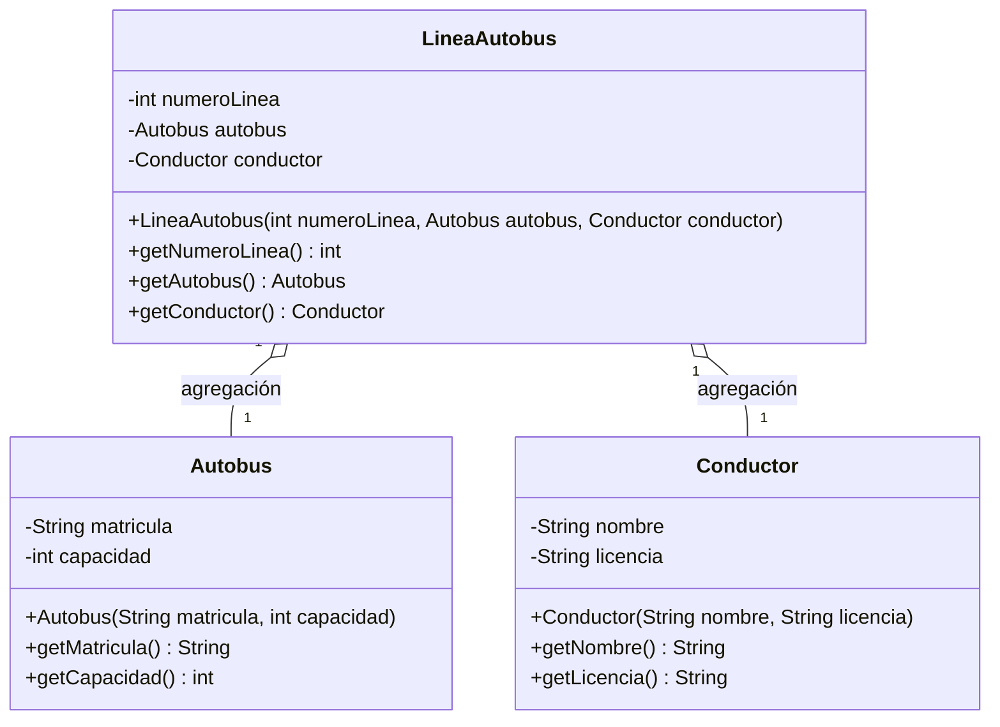

# Ejercicio 8.11 — Herencia frente a composición

## Decisión de diseño

**No existe ninguna relación de herencia** entre `Conductor`, `Autobus` y
`LineaAutobus`: ninguna de las tres es un caso especializado ("es un") de
otra. Son tres entidades del dominio conceptualmente distintas e
independientes que colaboran entre sí, no una jerarquía de tipos.

La relación entre `LineaAutobus` y sus dos colaboradores es de
**agregación**, no de composición: `Autobus` y `Conductor` se crean fuera de
`LineaAutobus` y se le entregan ya construidos por el constructor. Esto
importa porque, en la realidad, un conductor puede cambiar de línea entre
turnos y un autobús puede reasignarse a una línea distinta por mantenimiento
o refuerzo; ninguno de los dos objetos nace ni muere junto con la línea a la
que están asignados en un momento dado, que es justo lo que distingue a la
agregación de la composición.

## Diagrama de clases UML

El diamante hueco (`o--`) representa agregación; un diamante relleno
(`*--`) habría representado composición, que no es el caso aquí.
