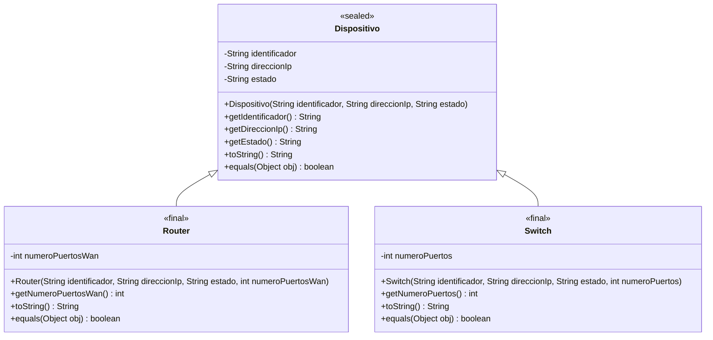

# Ejercicio 8.12 — Diagrama de clases UML (diseño previo a la implementación)

**Justificación de `sealed`:** el dominio modelado (dispositivos de una red
de telecomunicaciones gestionada) se restringe deliberadamente a un conjunto
cerrado y conocido de tipos, `Router` y `Switch`; no se pretende que
cualquier código externo pueda añadir tipos de dispositivo arbitrarios. Esto
justifica declarar `Dispositivo` como `sealed` con `permits Router, Switch`,
en vez de dejarla abierta a extensión libre.
